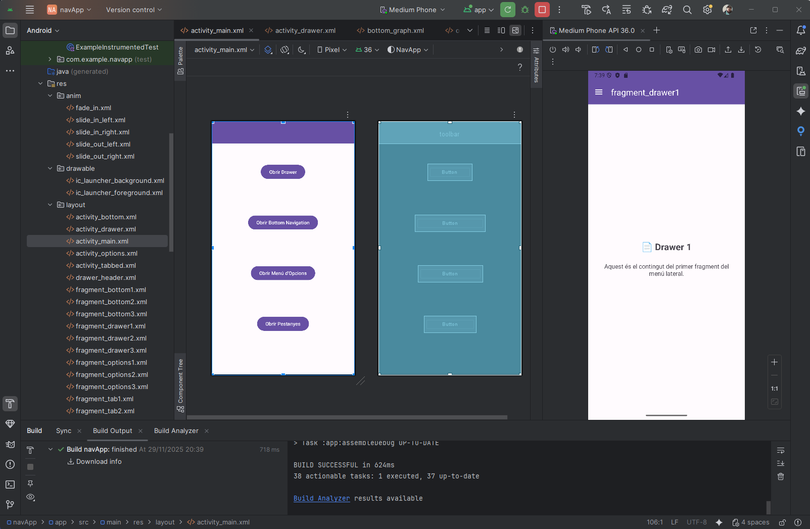
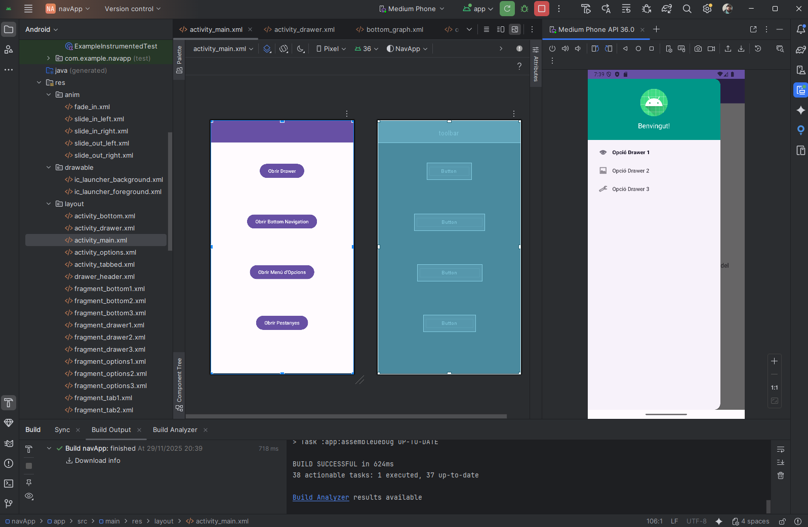
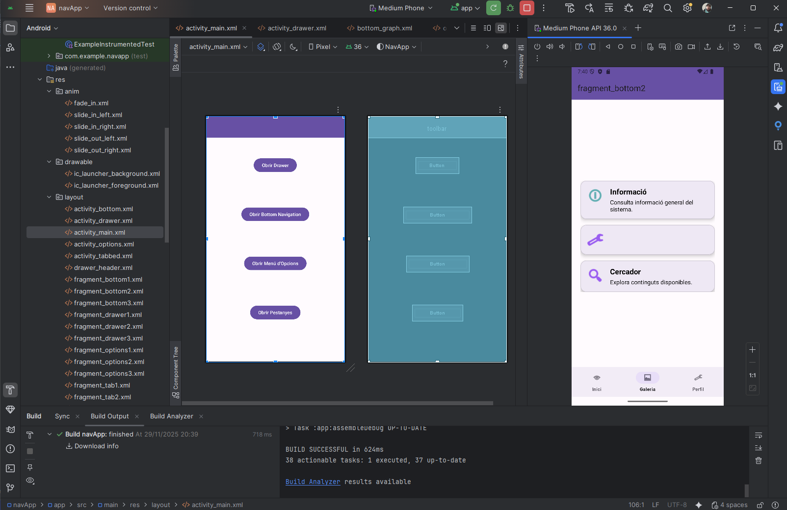
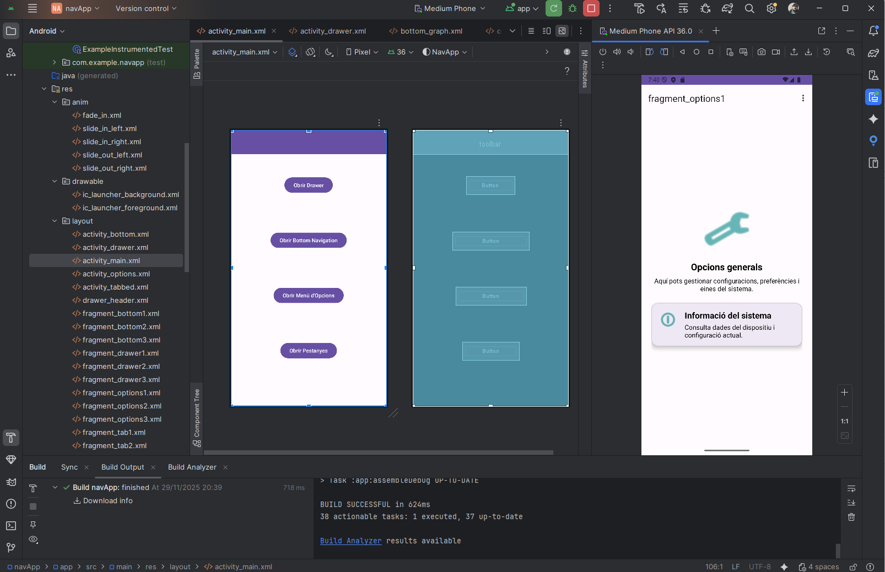
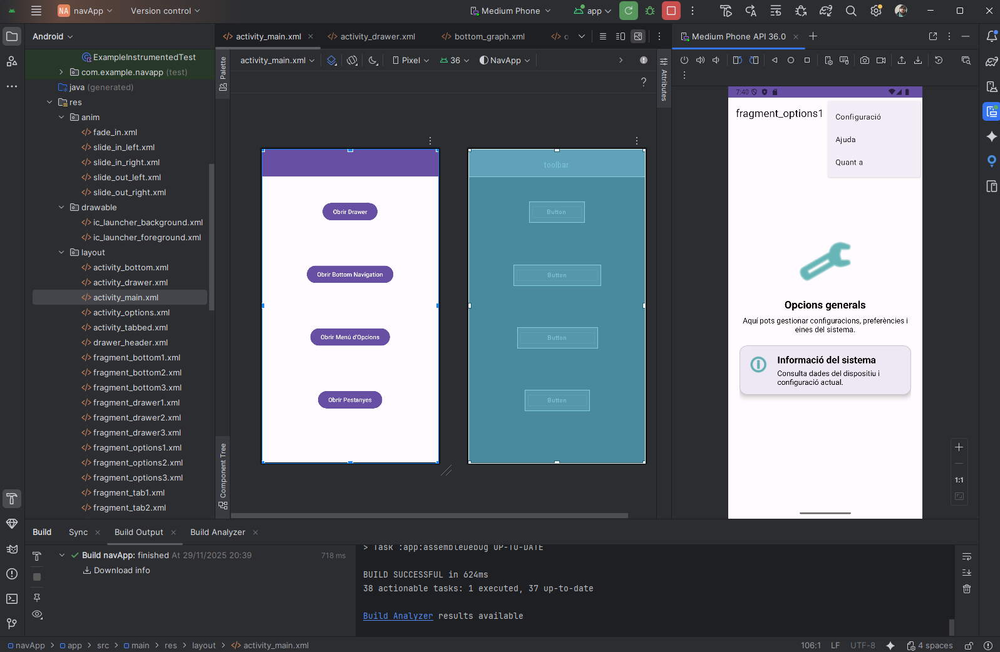

# 📱 NavApp – Pràctica de Navegació a Android (Drawer · Bottom · Options · Tabs)

Aplicació d’exemple per al mòdul **DAM0489 – Programació multimèdia i dispositius mòbils** on implementem **4 sistemes de navegació diferents** en una sola app Android:

1. 🧭 **Navigation Drawer** (menú lateral)
2. 📌 **Bottom Navigation** (menú inferior)
3. ☰ **Options Menu** (menú d’opcions a la Toolbar)
4. 🗂 **Tabbed Navigation** (pestanyes amb ViewPager2 + TabLayout)

A més, la pràctica incorpora:

- 🌍 **Internacionalització** (ca, es, en, de, zh_CN, zh_TW)
- 🎨 **Temes Light/Dark** amb Material Design
- 🎬 **Animacions de navegació** entre fragments
- 🧱 Ús de **Navigation Component** i patrons moderns d’Android

---

## 📸 Captures de pantalla

Les captures estan dins la carpeta `img/` del projecte:

- `img/Captura1.png` – Primer menú (Drawer) – Vista principal / accés  
- `img/Captura2.png` – Primer menú (Drawer) – Exemple de secció  
- `img/Captura3.png` – Segon menú (Bottom Navigation)  
- `img/Captura4.png` – Tercer menú (Options Menu) – Vista general  
- `img/Captura5.png` – Tercer menú (Options Menu) – Secció interna  
- `img/Captura6.png` – Quart menú (Tabbed Navigation)









---

## 🧱 Estructura general del projecte

```text
app/
├── java/com/example/navapp/
│   ├── MainActivity.kt
│   ├── DrawerActivity.kt
│   ├── BottomActivity.kt
│   ├── OptionsActivity.kt
│   ├── TabbedActivity.kt
│   ├── TabsPagerAdapter.kt
│   ├── Bottom1Fragment.kt
│   ├── Bottom2Fragment.kt
│   ├── Bottom3Fragment.kt
│   ├── Drawer1Fragment.kt, Drawer2Fragment.kt, Drawer3Fragment.kt
│   ├── Options1Fragment.kt, Options2Fragment.kt, Options3Fragment.kt
│   └── Tabbed1AFragment.kt, Tabbed2AFragment.kt, Tabbed3AFragment.kt
│
├── res/layout/
│   ├── activity_main.xml
│   ├── activity_drawer.xml
│   ├── activity_bottom.xml
│   ├── activity_options.xml
│   ├── activity_tabbed.xml
│   ├── drawer_header.xml
│   ├── fragment_bottom1.xml, fragment_bottom2.xml, fragment_bottom3.xml
│   ├── fragment_drawer1.xml, fragment_drawer2.xml, fragment_drawer3.xml
│   ├── fragment_options1.xml, fragment_options2.xml, fragment_options3.xml
│   └── fragment_tabbed1a.xml, fragment_tabbed2a.xml, fragment_tabbed3a.xml
│
├── res/navigation/
│   ├── drawer_graph.xml
│   ├── bottom_graph.xml
│   ├── options_graph.xml
│   └── (si cal) tabbed_graph.xml
│
├── res/menu/
│   ├── drawer_menu.xml
│   ├── bottom_menu.xml
│   └── options_menu.xml
│
├── res/anim/
│   ├── slide_in_right.xml
│   ├── slide_out_left.xml
│   ├── slide_in_left.xml
│   └── slide_out_right.xml
│
└── res/values*/ (colors, themes, strings, dimens, styles, …)
```

---

## 🎯 Objectius didàctics de l’activitat

* Entendre la diferència entre **Activity** i **Fragment**.
* Utilitzar **Navigation Component** (NavHostFragment + NavController + grafs).
* Implementar **4 sistemes de navegació** habituals a Android.
* Configurar **Toolbar** com a ActionBar i integrar-la amb Navigation.
* Treballar amb **menús XML**: `menu/`.
* Afegir **animacions de transició** entre fragments.
* Internacionalitzar tota la UI amb **strings multillenguatge**.
* Utilitzar **temes Light/Dark**, colors i estils reutilitzables.


---

## 🏁 Pantalla d’entrada: `MainActivity`

**Fitxer:** `activity_main.xml` + `MainActivity.kt`

Funció: és el **hub** de l’app, amb 4 botons que obren cadascun dels sistemes de navegació:

```kotlin
findViewById<Button>(R.id.action_goto_drawerActivity).setOnClickListener {
    startActivity(Intent(this, DrawerActivity::class.java))
}
```

Els botons:

* `Drawer` → obre **DrawerActivity**
* `Bottom` → obre **BottomActivity**
* `Options` → obre **OptionsActivity**
* `Tabs` → obre **TabbedActivity**

Layout resumit (XML):

```xml
<Button
    android:id="@+id/action_goto_drawerActivity"
    android:text="@string/btn_go_drawer" ... />

<Button
    android:id="@+id/action_goto_bottomActivity"
    android:text="@string/btn_go_bottom" ... />

<Button
    android:id="@+id/action_goto_optionsActivity"
    android:text="@string/btn_go_options" ... />

<Button
    android:id="@+id/action_goto_tabbedActivity"
    android:text="@string/btn_go_tabs" ... />
```

---

## 🧭 1) Navigation Drawer (`DrawerActivity`)

### 🧩 Layout principal: `activity_drawer.xml`

Components:

* `DrawerLayout` → contenidor global
* `CoordinatorLayout` → cos principal
* `AppBarLayout` + `Toolbar` → barra superior
* `FragmentContainerView` (`nav_host_fragment`) → contingut dinàmic
* `NavigationView` → menú lateral amb `drawer_menu.xml`

Punt clau:

```xml
<androidx.drawerlayout.widget.DrawerLayout ...>

    <androidx.coordinatorlayout.widget.CoordinatorLayout ...>
        <com.google.android.material.appbar.AppBarLayout ...>
            <androidx.appcompat.widget.Toolbar ... />
        </com.google.android.material.appbar.AppBarLayout>

        <androidx.fragment.app.FragmentContainerView
            android:id="@+id/nav_host_fragment"
            android:name="androidx.navigation.fragment.NavHostFragment"
            app:navGraph="@navigation/drawer_graph"
            app:defaultNavHost="true" />
    </androidx.coordinatorlayout.widget.CoordinatorLayout>

    <com.google.android.material.navigation.NavigationView
        android:id="@+id/nav_view"
        app:menu="@menu/drawer_menu"
        app:headerLayout="@layout/drawer_header"/>
</androidx.drawerlayout.widget.DrawerLayout>
```

### 🧠 Codi Kotlin: `DrawerActivity.kt`

* Crea `NavController` des del `NavHostFragment`.
* Defineix `AppBarConfiguration` amb els **top-level destinations** (fragments del menú).
* Connecta Toolbar + NavigationView amb el `NavController`:

```kotlin
val navHostFragment = supportFragmentManager
    .findFragmentById(R.id.nav_host_fragment) as NavHostFragment

navController = navHostFragment.navController

appBarConfiguration = AppBarConfiguration(
    setOf(R.id.drawer1Fragment, R.id.drawer2Fragment, R.id.drawer3Fragment),
    drawerLayout
)

NavigationUI.setupActionBarWithNavController(this, navController, appBarConfiguration)
NavigationUI.setupWithNavController(navView, navController)
```

---

## 📌 2) Bottom Navigation (`BottomActivity`)

### 🧩 Layout principal: `activity_bottom.xml`

Components:

* `AppBarLayout` + `Toolbar`
* `FragmentContainerView` (`bottom_nav_host`) amb `bottom_graph.xml`
* `BottomNavigationView` amb `bottom_menu.xml`

Resum:

```xml
<androidx.coordinatorlayout.widget.CoordinatorLayout ...>

    <com.google.android.material.appbar.AppBarLayout ...>
        <androidx.appcompat.widget.Toolbar
            android:id="@+id/toolbar" ... />
    </com.google.android.material.appbar.AppBarLayout>

    <androidx.fragment.app.FragmentContainerView
        android:id="@+id/bottom_nav_host"
        android:name="androidx.navigation.fragment.NavHostFragment"
        app:navGraph="@navigation/bottom_graph"
        app:defaultNavHost="true" />

    <com.google.android.material.bottomnavigation.BottomNavigationView
        android:id="@+id/bottom_nav"
        app:menu="@menu/bottom_menu" />

</androidx.coordinatorlayout.widget.CoordinatorLayout>
```

### 🧠 Codi Kotlin: `BottomActivity.kt`

```kotlin
val navHostFragment = supportFragmentManager
    .findFragmentById(R.id.bottom_nav_host) as NavHostFragment
navController = navHostFragment.navController

appBarConfiguration = AppBarConfiguration(
    setOf(R.id.bottom1Fragment, R.id.bottom2Fragment, R.id.bottom3Fragment)
)

NavigationUI.setupActionBarWithNavController(this, navController, appBarConfiguration)
NavigationUI.setupWithNavController(bottomNav, navController)
```

### 🎬 Animacions al `bottom_graph.xml`

Exemple d’acció amb animacions:

```xml
<action
    android:id="@+id/action_bottom1_to_bottom2"
    app:destination="@id/bottom2Fragment"
    app:enterAnim="@anim/slide_in_right"
    app:exitAnim="@anim/slide_out_left"
    app:popEnterAnim="@anim/slide_in_left"
    app:popExitAnim="@anim/slide_out_right" />
```

I els XML d’animació a `res/anim/`:

```xml
<!-- slide_in_right.xml -->
<translate xmlns:android="http://schemas.android.com/apk/res/android"
    android:fromXDelta="100%" android:toXDelta="0%" android:duration="300" />
```

---

## ☰ 3) Options Menu (`OptionsActivity`)

### 🧩 Layout: `activity_options.xml`

```xml
<androidx.coordinatorlayout.widget.CoordinatorLayout ...>

    <com.google.android.material.appbar.AppBarLayout ...>
        <androidx.appcompat.widget.Toolbar
            android:id="@+id/toolbar"
            app:title="Opcions" />
    </com.google.android.material.appbar.AppBarLayout>

    <androidx.fragment.app.FragmentContainerView
        android:id="@+id/nav_host_options"
        android:name="androidx.navigation.fragment.NavHostFragment"
        app:navGraph="@navigation/options_graph"
        app:defaultNavHost="true" />

</androidx.coordinatorlayout.widget.CoordinatorLayout>
```

### 🧠 Codi Kotlin: `OptionsActivity.kt`

* Infla el **menú d’opcions** a la Toolbar (`onCreateOptionsMenu`).
* Gestiona els clics amb `onOptionsItemSelected` i navega amb `NavController`:

```kotlin
override fun onCreateOptionsMenu(menu: Menu?): Boolean {
    menuInflater.inflate(R.menu.options_menu, menu)
    return true
}

override fun onOptionsItemSelected(item: MenuItem): Boolean {
    return when (item.itemId) {
        R.id.menu_settings -> {
            navController.navigate(R.id.options2Fragment)
            true
        }
        R.id.menu_help -> {
            navController.navigate(R.id.options3Fragment)
            true
        }
        R.id.menu_about -> {
            navController.navigate(R.id.options1Fragment)
            true
        }
        else -> super.onOptionsItemSelected(item)
    }
}
```

### 🗂 Menú: `options_menu.xml`

```xml
<menu ...>
    <item
        android:id="@+id/menu_settings"
        android:title="@string/menu_settings"
        android:icon="@android:drawable/ic_menu_manage"
        app:showAsAction="never" />

    <item
        android:id="@+id/menu_help"
        android:title="@string/menu_help"
        android:icon="@android:drawable/ic_menu_help"
        app:showAsAction="never" />

    <item
        android:id="@+id/menu_about"
        android:title="@string/menu_about"
        android:icon="@android:drawable/ic_menu_info_details"
        app:showAsAction="never" />
</menu>
```

---

## 🗂 4) Tabbed Navigation (`TabbedActivity`)

### 🧩 Layout: `activity_tabbed.xml`

```xml
<androidx.coordinatorlayout.widget.CoordinatorLayout ...>

    <com.google.android.material.appbar.AppBarLayout ...>
        <androidx.appcompat.widget.Toolbar
            android:id="@+id/toolbar"
            app:title="Pestanyes" />
    </com.google.android.material.appbar.AppBarLayout>

    <LinearLayout
        android:orientation="vertical" ...>

        <com.google.android.material.tabs.TabLayout
            android:id="@+id/tabLayout" ... />

        <androidx.viewpager2.widget.ViewPager2
            android:id="@+id/viewPager" ... />

    </LinearLayout>
</androidx.coordinatorlayout.widget.CoordinatorLayout>
```

### 🧠 Codi Kotlin: `TabbedActivity.kt` + `TabsPagerAdapter`

```kotlin
val tabLayout = findViewById<TabLayout>(R.id.tabLayout)
val viewPager = findViewById<ViewPager2>(R.id.viewPager)

val adapter = TabsPagerAdapter(this)
viewPager.adapter = adapter

TabLayoutMediator(tabLayout, viewPager) { tab, position ->
    when (position) {
        0 -> tab.text = "Inici"
        1 -> tab.text = "Llista"
        2 -> tab.text = "Perfil"
    }
}.attach()
```

I l’adaptador:

```kotlin
class TabsPagerAdapter(activity: FragmentActivity) : FragmentStateAdapter(activity) {
    override fun getItemCount(): Int = 3
    override fun createFragment(position: Int): Fragment =
        when (position) {
            0 -> Tabbed1AFragment()
            1 -> Tabbed2AFragment()
            2 -> Tabbed3AFragment()
            else -> Tabbed1AFragment()
        }
}
```

---

## 🌍 Internacionalització (i18n)

S’ha treballat amb **fitxers `strings.xml` per idiomes**:

* `res/values/strings.xml` → català (base)
* `res/values-es/strings.xml` → castellà
* `res/values-en/strings.xml` → anglès
* `res/values-de/strings.xml` → alemany
* `res/values-zh-rCN/strings.xml` → xinès simplificat
* `res/values-zh-rTW/strings.xml` → xinès tradicional

Exemple de clau compartida:

```xml
<!-- Català -->
<string name="bottom_item_home">Inici</string>

<!-- Castellà -->
<string name="bottom_item_home">Inicio</string>

<!-- Anglès -->
<string name="bottom_item_home">Home</string>

<!-- Alemany -->
<string name="bottom_item_home">Startseite</string>
```

A tots els layouts i menús **no s’escriuen textos literals**, sinó referències a `@string/...`.

---

## 🎨 Temes, colors i estils

### 🎨 Colors (`colors.xml`)

Paleta basada en **Material Design 3** amb variació Light/Dark:

* `md_theme_light_*` i `md_theme_dark_*`
* Colors extra: `success`, `warning`, `info`, `purple_500`, `purple_700`, etc.

### 🧵 Temes (`themes.xml` i `themes-night.xml`)

Tema base:

```xml
<style name="Base.Theme.NavApp" parent="Theme.Material3.Light.NoActionBar">
    <item name="colorPrimary">@color/md_theme_light_primary</item>
    ...
</style>

<style name="Theme.NavApp" parent="Base.Theme.NavApp" />
```

I la versió night a `values-night/themes.xml` amb colors foscos.

### ✏ Estils i dimens

* `styles.xml` → `AppTheme`, `AppTheme.Toolbar`, temes específics per activitat si cal.
* `dimens.xml` → `padding_large`, `padding_medium`, mides de text, alçada de botons, etc.

---

## 🎬 Resum de les animacions

S’han definit a `res/anim/`:

* `slide_in_right.xml`
* `slide_out_left.xml`
* `slide_in_left.xml`
* `slide_out_right.xml`

Associades als `action` de `bottom_graph.xml` per aconseguir efecte **slide** en canviar de secció del Bottom Navigation.

---

## ✅ Conclusions de la pràctica

Amb aquesta activitat l’alumnat:

* Ha creat **una app Android estructurada i modular**.
* Ha experimentat amb **4 sistemes de navegació oficials**.
* Ha après a utilitzar **Navigation Component** amb Toolbar i menús.
* Ha aplicat **animacions XML** per millorar l’experiència d’usuari.
* Ha practicat la **internacionalització** amb múltiples idiomes.
* Ha configurat **temes i estils reutilitzables**.

És una base ideal per a:

* Futures pràctiques ABP (apps reals).
* Integrar dades (API/BD) sobre aquesta mateixa estructura de navegació.
* Migrar posteriorment a **Jetpack Compose** mantenint la lògica de navegació.

---

---

# 🔧 🔄 AMPLIACIÓ DE LA PRÀCTICA

## Integració dels 4 sistemes de navegació en UNA sola Activity

> **IMPORTANT:**
> Aquesta ampliació **NO substitueix** la pràctica original.
> **NO s’ha d’eliminar ni modificar cap fitxer existent.**
> Les activitats actuals (`DrawerActivity`, `BottomActivity`, `OptionsActivity`, `TabbedActivity`) serveixen com a **referència funcional**.

---

## 🎯 Objectiu de l’ampliació

Crear **una única Activity** que integri simultàniament:

1. 🧭 Navigation Drawer
2. 📌 Bottom Navigation
3. ☰ Options Menu
4. 🗂 Tabbed Navigation

Tot utilitzant:

* **una sola Toolbar**
* **un sol NavHostFragment**
* **un únic NavController**

Aquest és el model d’arquitectura utilitzat en **apps Android professionals modernes**.

---

## 🧱 Enfocament arquitectònic

L’alumnat ha de crear una nova activitat, per exemple:

```
UnifiedNavigationActivity.kt
```

amb el seu layout:

```
activity_unified_navigation.xml
```

Aquesta Activity actuarà com a **contenidor global** de navegació, reutilitzant:

* fragments ja existents
* menús XML ja creats
* animacions existents
* recursos de strings i temes

---

## 🧩 Layout unificat

El layout ha de combinar **components ja utilitzats** al projecte:

* `DrawerLayout`
* `CoordinatorLayout`
* `AppBarLayout` + `Toolbar`
* `FragmentContainerView` (NavHostFragment)
* `BottomNavigationView`
* `NavigationView`

No s’introdueixen components nous, només es **reorganitzen** dins una sola Activity.

---

## 🧠 Gestió del NavController

A la nova Activity:

* S’obté **un únic NavController**
* Es defineixen tots els fragments principals com a **top-level destinations**
* El `DrawerLayout` es passa a l’`AppBarConfiguration`

Això permet una navegació coherent entre tots els sistemes.

---

## ☰ Options Menu integrat

L’Options Menu deixa de dependre d’una Activity pròpia i passa a formar part de la mateixa Activity unificada mitjançant:

* `onCreateOptionsMenu()`
* `onOptionsItemSelected()`
* navegació amb `NavController.navigate()`

---

## 📌 Convivència Drawer + Bottom Navigation

Ambdós menús es connecten al **mateix NavController** mitjançant `NavigationUI`, assegurant que:

* els `id` dels menús coincideixin amb els fragments del graph
* no hi hagi conflictes de navegació

---

## 🗂 Pestanyes dins el sistema unificat

La navegació per pestanyes:

* es manté amb `ViewPager2` + `FragmentStateAdapter`
* s’integra com una secció més del NavGraph
* gestiona la navegació interna sense NavController

---

## 📍 Graph de navegació unificat

Es recomana crear un nou `navigation graph` que:

* referenciï fragments existents
* no dupliqui codi
* centralitzi tota la navegació de l’app

---

## ✅ Criteris de validació de l’ampliació

L’ampliació es considera correcta si:

✔️ Hi ha **una sola Activity funcional**
✔️ Conviuen els **4 sistemes de navegació**
✔️ Hi ha **un únic NavController**
✔️ Es reutilitza codi existent
✔️ No s’ha eliminat res de la pràctica original

---